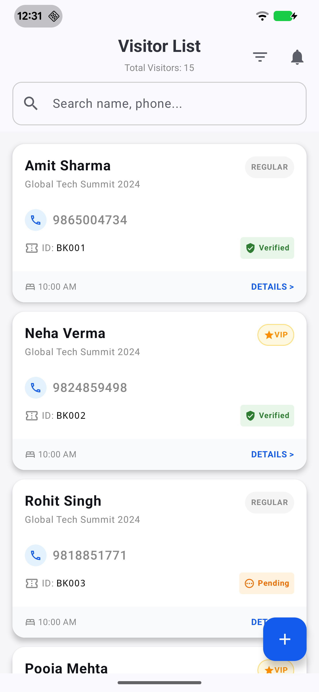

# VisitorLog - Offline Storage with Room & Pagination

**Project Title:** Data Offline Storage using Room Database with Pagination

## 📱 Project Overview
**VisitorLog** is an Android application designed to demonstrate efficient handling of large datasets using **Pagination 3**, **Room Database** for offline storage, and **Jetpack Compose** (or XML/View system depending on implementation) for the UI. The app fetches guest data from a remote API, caches it locally to ensure an "offline-first" experience, and displays it in a scrollable list with smooth pagination.

## 🎯 Objective
- Fetch paginated data from a REST API.
- Store data locally using Room Database for offline access.
- Display data efficiently using Pagination.
- Implement "Pull-to-Refresh" to clear the cache and reload data.
- Search functionality by Name or Mobile Number.

## 📸 Screenshots

| Visitor List UI |
|:---:|
|  |
| *Displays paginated guest list with offline support* |

> **[Download Demo APK](#)** *(Replace this with your actual APK link)*

## 🛠 Tech Stack & Architecture

- **Language:** Kotlin
- **UI Architecture:** MVVM (Model-View-ViewModel)
- **Dependency Injection:** Hilt
- **Network:** Retrofit + OkHttp + Gson
- **Local Database:** Room Database
- **Pagination:** Paging 3 Library (with `RemoteMediator` for network + database caching)
- **Concurrency:** Coroutines + Flow

## ✨ Key Features

1.  **Paginated Data Loading:**
    - Loads data in chunks (Page size: 5) to optimize memory and network usage.
    - Uses `RemoteMediator` to handle paging logic between the API and the local database.

2.  **Offline-First Experience:**
    - Data is saved to `GuestDatabase` immediately after fetching.
    - App displays cached data when the device is offline.

3.  **Search Functionality:**
    - Real-time search filters guests by **Name** or **Contact Number**.
    - Search queries trigger database lookups directly.

4.  **Robust UI States:**
    - **Loading:** Full-screen loader for initial fetch; footer loader for appending pages.
    - **Empty:** "No guest data available" message.
    - **Error:** Toast messages and Retry buttons for failed requests.

5.  **Pull-to-Refresh:**
    - Swipe down to clear the local database and re-fetch fresh data from page 1.

## 📡 API Details

- **Endpoint:** `https://plannix.in/web/guest_list.php`
- **Method:** `POST`
- **Parameters:**
    - `page` (Int): Current page number.
    - `limit` (Int): Records per page (set to 5).

## 📂 Project Structure

```text
com.visitor.log
├── data
│   ├── db              # Room Database, DAO, Entities
│   ├── model           # Data classes (DTOs, Entity, RemoteKeys)
│   ├── network         # Retrofit Service
│   └── repository      # Repository & RemoteMediator
├── di                  # Hilt Dependency Injection Modules
├── mainui
│   └── guestscreen     # UI Layer
│       ├── ui          # Screens / Fragments
│       └── viewmodel   # ViewModel managing PagingData flow
└── ui.theme            # App Theme & Colors

🚀 Getting Started
Clone the repository:

Bash

git clone [https://github.com/your-username/VisitorLog.git](https://github.com/your-username/VisitorLog.git)
Open in Android Studio:

File > Open > Select the cloned folder.

Sync Gradle:

Allow the project to download dependencies.

Run the App:

Connect a device or start an emulator and click "Run".

📝 Usage
Scrolling: Scroll down to automatically load the next set of visitors.

Refreshing: Pull down from the top of the list to refresh data.

Searching: Type in the search bar to filter the list instantly.
